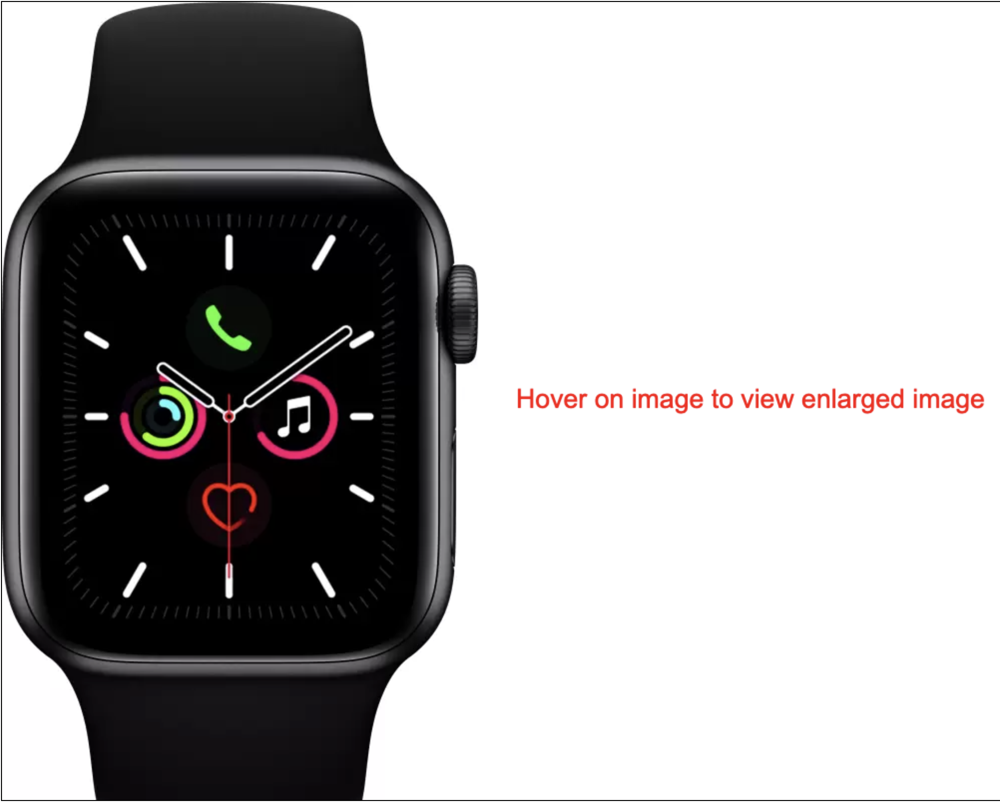
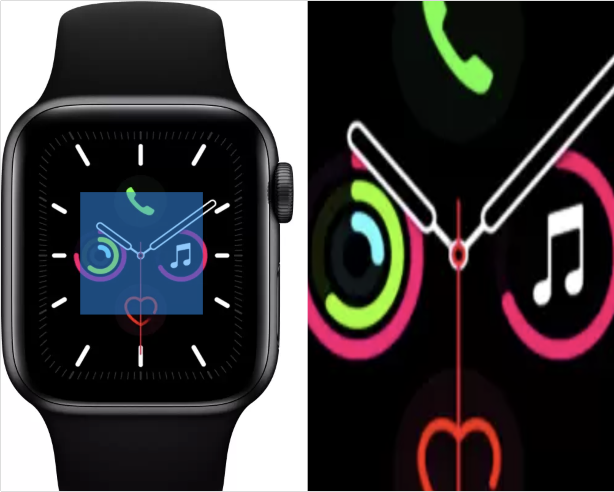

<h1 align="center">Enlarge image on hover</h1>

  

<h2 align="center"><a  href="https://master.d24zkhpqnxeyrj.amplifyapp.com/">Live Demo</a></h2>

## Description

**Enlarge image on hover**

    

### About the project 
In e-commerce website like Flipkart or Amazon one of the important feature is scaling of the image (product) on hover. 
An attempt is made to implement that feature using HTML5 Canvas. 

The top-left 50% of the canvas shows the image to scale and the other half shows the scaled image. 

# Credits
Image : https://rukminim2.flixcart.com/image/832/832/k0o69ow0/smartwatch/3/s/c/mwv82hn-a-apple-original-imafkffzz6ppzemy.jpeg?q=70